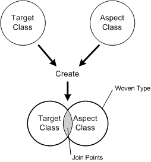

## Project Description
The LOOM.NET project aims to investigate and promote the usage of AOP in the context of the Microsoft .NET framework.

The concept of aspect-oriented programming (AOP) offers an interesting alternative for the specification of non-functional component properties (such as fault-tolerance properties or timing behaviour), as well as other crosscutting concerns. These are implemented as so-called aspects and at some point "weaved" to the other functional parts of the software.

The LOOM.NET approach is an approach that offers both: a static and a dynamic aspect weaver. The project was started in 2001 with the advent of Microsoft.Net and subsequently we released the first available aspect weaver for .NET. Like no other AOP-frameworks LOOM.NET significantly influences the Microsoft.NET AOP community. 

## How it works
Realized as a class library, LOOM.NET allows the language-independend definition of aspect code in the form of standard .NET classes. Both aspect weavers are fully binary compatible. Aspects written for Rapier-LOOM.NET would work with Gripper-LOOM.NET and vice versa. 

An _aspect class_ is a special .NET class with methods constructors and fields as well. At defined _join points_ an aspect class becomes interwoven with a _target class_. Interweaving, strictly speaking, means that an aspect method will be interwoven with a target class method. The aspect method itself contains the aspect code and is defined within the aspect class. It has a special aspect method attribute applied. This aspect method attribute declares a method in the aspect class as an aspect method. Not necessarily every method in an aspect class is an aspect method and has this attribute applied. Methods without this attribute will not be considered for the weaving process.

A target class is a regular .NET class. The one and only restriction is that target class methods (which should become interwoven) either have to be virtual or to be defined via an interface. The weaving process will be initiated during runtime with a factory. Instead of using the new operator one uses the weavers factory method to produce interwoven objects. 

## Papers
Wolfgang Schult
Architektur Komponentenbasierter Systeme mit LOOM - Aspekte, Muster, Werkzeuge
PhD Thesis, Cuvillier, 2009.
[https://www.amazon.de/ARCHITEKTUR-KOMPONENTEN-BASIERTER-SYSTEME-WERKZEUGE/dp/3869550317/ref=sr_1_25?s=books&ie=UTF8&qid=1319717920&sr=1-25](https://www.amazon.de/ARCHITEKTUR-KOMPONENTEN-BASIERTER-SYSTEME-WERKZEUGE/dp/3869550317/ref=sr_1_25?s=books&ie=UTF8&qid=1319717920&sr=1-25)

Andreas Rasche and Wolfgang Schult
Dynamic Updates of Graphical Components in the .NET Framework
In Proceedings of Workshop on Selbstorganisierende, Adaptive, Kontextsensitive verteilte Systeme im Rahmen der GI/ITG-Tagung Kommunikation in Verteilten Systemen, Bern / Schweiz, 1. March 2007
[http://www.dcl.hpi.uni-potsdam.de/papers/papers/rasche_updategraphical_saks2007.pdf](http://www.dcl.hpi.uni-potsdam.de/papers/papers/rasche_updategraphical_saks2007.pdf)

Andreas Rasche, Wolfgang Schult, and Andreas Polze
Self-Adaptive Multithreaded Applications - A Case for Dynamic Aspect Weaving
In Proceedings of the 4th Workshop on Adaptive and Reflective Middleware (ARM 2005), Grenoble, France - November 28, 2005
[http://www.dcl.hpi.uni-potsdam.de/papers/papers/rasche_self-adaptive.pdf](http://www.dcl.hpi.uni-potsdam.de/papers/papers/rasche_self-adaptive.pdf)

Wolfgang Schult
Rapier-LOOM.NET — A Dynamic Aspect Weaver for .NET
Microsoft Research AOP Goes .NET Workshop, Redmond, USA, 2005
[http://research.microsoft.com/apps/mobile/showpage.aspx?page=/en-us/events/aop/default.aspx](http://research.microsoft.com/apps/mobile/showpage.aspx?page=/en-us/events/aop/default.aspx)

Kai Köhne, Wolfgang Schult, Andreas Polze
Design by Contract in .NET Using Aspect Oriented Programming, 2005
[http://www.dcl.hpi.uni-potsdam.de/people/schult/Slides/DBC.pdf](http://www.dcl.hpi.uni-potsdam.de/people/schult/Slides/DBC.pdf)

Wolfgang Schult, Andreas Polze
Speed vs. Memory Usage - An Approach to Deal with Contrary Aspects.
The Second AOSD Workshop on Aspects, Components, and Patterns for Infrastructure Software (ACP4IS) at the International Conference on
Aspect-Oriented Software Development, Boston, Massachusetts, March 17 - 21 2003.
[http://www.dcl.hpi.uni-potsdam.de/cms/papers/papers/acp4is_aosd2003.pdf](http://www.dcl.hpi.uni-potsdam.de/cms/papers/papers/acp4is_aosd2003.pdf)

Wolfgang Schult, Andreas Polze
Dynamic Aspect-Weaving with .NET.
Workshop zur Beherrschung nicht-funktionaler Eigenschaften in Betriebssystemen und verteilten Systemen, TU Berlin, Germany, 7-8 November 2002 
[http://www.dcl.hpi.uni-potsdam.de/cms/papers/papers/GI2002.ps](http://www.dcl.hpi.uni-potsdam.de/cms/papers/papers/GI2002.ps)

Wolfgang Schult, Andreas Polze
Aspect-Oriented Programming with C# and .NET.
In Proceedings of International Symposium on Object-oriented Real-time distributed Computing (ISORC) 2002, pp. 241-248, Washington D.C., April 2002.
[http://www.dcl.hpi.uni-potsdam.de/cms/papers/papers/isorc2002.pdf](http://www.dcl.hpi.uni-potsdam.de/cms/papers/papers/isorc2002.pdf)
